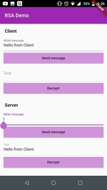

# sample_crypto

This sample application demonstrates the use of RSA cryptographic algorithm by emulating communication between a client and a server.

## Plug and play

You do not need to install any thing other than running 'flutter packages get' after cloning this repo. 

You can see how client sends a message by encrypting it with server's public key which can only be decrypted by server's private key.

# Screenshots

## Initial state

## Client sends a message encrypting it with server's public key

## Message is decrypted by the server using it's private key

## Server sends a message encrypting it with client's public key

## Message is decrypted by the client using it's private key

## Acknowledgement

I have used the [cypton](https://pub.dev/packages/crypton/example) package in this project. Thanks to the creator of this package, [konstantinullrich.de](https://pub.dev/publishers/konstantinullrich.de/packages).